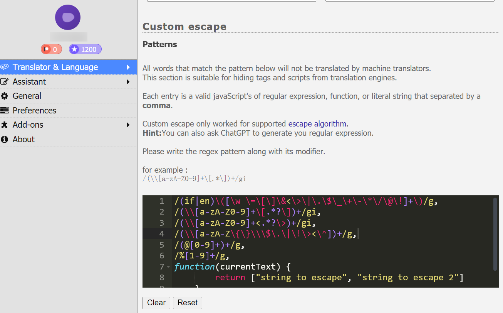
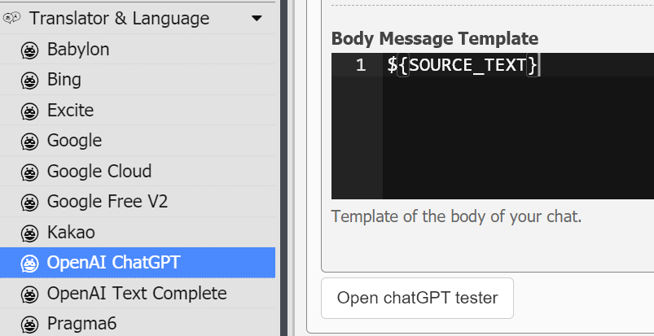
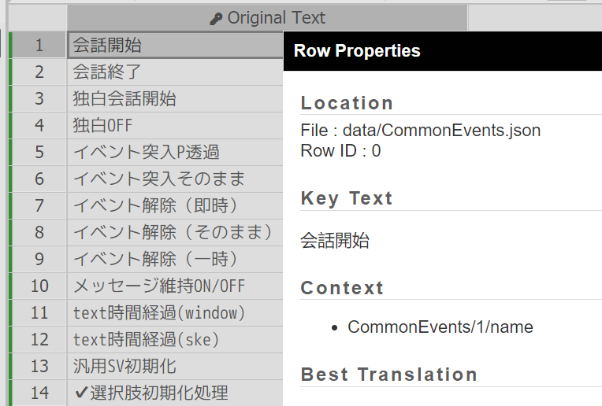

# Translator++工作流

由于RPGMaker制作的游戏在文本细节上各不相同，在翻译了数个不同的游戏后，我总结了一套比较优秀的工作流，希望可以帮大家获得更好的翻译质量。

**本文内容有较高上手门槛**

## Translator++设置

首先是自定义控制符，在翻译时，所有符合这些内容的文本都会被替换为`$dat[1]`这样的格式。由于各个游戏的控制符格式不同，官方默认的这些可能有未覆盖到的，需要单独处理。如图所示。



如果想得到更好的效果，我建议将更复杂的逻辑和提示词拼接工作放到Python后端处理。所以在OpenAI ChatGPT插件设置中，我建议清空**System Message Template**，将**Body Message Template**设置为仅包含`${SOURCE_TEXT}`，如图所示。



还有一些其它设置，例如如果想使用这个文件夹中的api，还需要将**Target URL**设置为`http://127.0.0.1:1500/v1/chat/completions`, **Batch Delay**设置为1，**Max Characters per Batch**设置为65536，**Max row per concurrent requests**尽量调大。

## 为特定路径的文本打标签

MTools翻译的一个缺点就是会把所有字符串都翻译了，而Translator++也会读取很多无意义的字符串。翻译这些字符串不仅耗时，而且可能会破坏一些游戏逻辑。可以右键行，通过**Row Properties**查看字符串的路径，如图所示。



Translator++拥有js脚本执行功能，选中需要执行脚本的文件，右键，在**With XX Selected -> Run Automation -> For Each Row**执行脚本。

更多执行细节，请参考[官方文档](https://dreamsavior.net/docs/translator/execute-script/pin-your-automation-to-quickly-launch-from-translator/)。

我推荐首先使用[脚本1](根据路径添加黄绿标签.js)对每行打标签，黄色为所有上下文路径都不需要翻译，绿色为仅有部分上下文路径需要翻译。

注意，由于每个游戏的差异，没有一劳永逸的正则表达式列表。为了提高翻译质量，建议开始翻以前人工浏览一遍，增减需要的正则表达式。

## 开始翻译

翻译的时候，红色和蓝色标签是Translator++加上的，记得和黄色的标签一起加入**黑名单**，这些行都不处理。

## Python后端

虽然重复造轮子不是好行为，但是一个简单的Python后端就可以做到很多事情，还是值得简单造一个轮子的。

[llm.py](llm.py) 和 [api.py](api.py) 这两个文件实现了一些简单的功能，文件注释写的比较详细，这里就不再赘述代码细节，只简单介绍。

### 使用方式

库依赖不多，主要就需要安装一个 [llama-cpp-python](https://llama-cpp-python.readthedocs.io/en/latest/) 和一个 FastAPI。

在修改了 [api.py](api.py) 的一些参数之后，只需要简单 `python api.py` 即可启动。

```py
port = 1500
logging.basicConfig(filename="log.log")
history_deque = deque(maxlen=3)
llm = LLM("galtransl", "Sakura-GalTransl-7B-v3-Q5_K_S.gguf", 8, ["0", "1", "2", "3", "0", "1", "2", "3"])
app = FastAPI()
dicts = [
    {"src": "控制符", "dst": "控制符"}
]
```

port为服务启动的端口号。

basicConfig可以设置日志文件名，日志会记录控制符和行数翻译前后不一致的部分，供人工更正。

history_deque控制最大提供给LLM的上文数量。

LLM的参数都有接口说明，值得一提的是工作进程数和CUDA列表：

- 如果显存足够，建议一张卡上跑两个工作进程，可以吃满显卡算力，不推荐更多。
- 如果有多张卡，可以每张卡上都跑单独的工作进程，这个配置是4张4090的参考配置。
- 这边的工作进程越多，Translator++就应该设置越大的**Max row per concurrent requests**，以减少上下文切换的损耗。

app一般不用修改。

dicts是提供给模型的字典，如果要使用这个后端，至少保留控制符这个说明。

如果不想深究，下面的小节可以跳过，直接看结束翻译段落即可。

### 控制符格式

代码中有一个处理，就是将Translator++的`${dat[1]}`这样的控制符全部替换为`控制符1`这样的文本，翻译完之后再替换回去。有什么用呢？请看例子：

> 味方単体に１ターン『${dat[1]}無敵』を付与

这段文本，如果直接让LLM翻译，很可能会丢失掉`${dat[1]}`这样的控制符，或者是插入在错误的位置。我也试过将前后分别翻译再拼接，反而会丢失上下文。这个问题卡了我很久，一度想让我去再训练一个可以处理控制符的模型。某一天我观察到LLM会倾向于原样输出中文文本，这给了我灵感，如果将控制符改成中文：

> 味方単体に１ターン『控制符1無敵』を付与

它就会翻译出正常的结果，并且把控制符放在合适的位置。哪怕是这种多控制符的文本：

> 控制符1敵全体にダメージを与え『控制符2心傷』『控制符3心弱』状態にする。

经过测试也可以正确翻译并处理控制符的位置。

### SG说明格式

代码中还有对`<SGXX:XX>`格式的说明的处理，例如：

> <SG説明:生徒達に命令する事で、
> 生徒達はＣＰを増やしたりします。
> 増やしたＣＰは、スキルツリー呪力領域の開放や、
> アイテム合成に使えます。>
> <SG共通説明:自由行動の説明です>
> <SGカテゴリ:\I[247]行動パート>

这个里面的key是不能翻译的，而value是需要翻译的，所以代码对其进行了简单的提取处理。

## 结束翻译

翻译完成后，记得将日志中记录的错误进行简单的人工修正。

然后使用[脚本2](绿色标签添加路径翻译.js)将绿色标签的上下文翻译自动设置完。

最后就可以直接注入翻译开始游戏。
