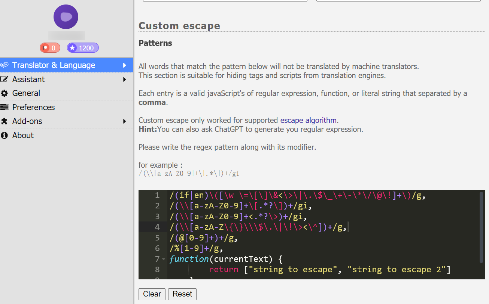
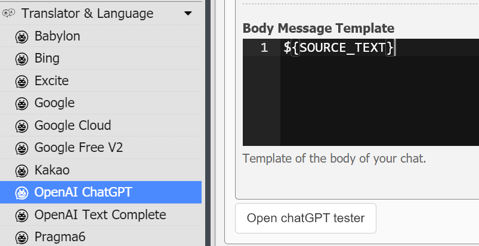
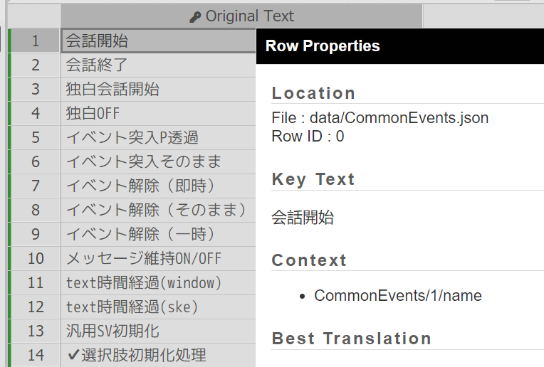

# 使用Translator++翻译的最佳实践

由于RPGMaker制作的游戏在文本细节上各不相同，在翻译了数个不同的游戏后，我总结了一套比较优秀的工作流，希望可以帮大家获得更好的翻译质量。

**本文内容有一定上手门槛**

## Translator++设置

首先是自定义控制符，在翻译时，所有符合这些内容的文本都会被替换为`$dat[1]`这样的格式。由于各个游戏的控制符格式不同，官方默认的这些可能有未覆盖到的，需要单独处理。如图所示。



如果想得到更好的效果，我建议将更复杂的逻辑和提示词拼接工作放到Python后端处理。所以在OpenAI ChatGPT插件设置中，我建议清空**System Message Template**，将**Body Message Template**设置为仅包含`${SOURCE_TEXT}`，如图所示。



## 为特定路径的文本打标签

MTools翻译的一个缺点就是会把所有字符串都翻译了，而Translator++也会读取很多无意义的字符串。翻译这些字符串不仅耗时，而且可能会破坏一些游戏逻辑。可以右键行，通过**Row Properties**查看字符串的路径，如图所示。



Translator++拥有js脚本执行功能，右键**Run Automation->For Each Row**执行以下脚本，可以为所有路径符合以下正则表达式的行打上绿色标签，之后翻译的时候忽略即可。

```js
if (!Array.isArray(this.context)) {
    return;
}
var result = false;
const regexs = [
    /^Actors\/\d+\/note$/,
    /^Animations.*?$/,
    /^Armors\/\d+\/note$/,
    /^CommonEvents\/\d+\/name$/,
    /^CommonEvents\/\d+\/list\/\d+\/comment$/,
    /^Enemies\/\d+\/note$/,
    /^Items\/\d+\/note$/,
    /^Map\d{3}\/events\/\d+\/(name|note)$/,
    /^Mapinfos.*?$/,
    /^Skills\/\d+\/note$/,
    /^States\/\d+\/note$/,
    /^System\/switches\/\d+$/,
    /^System\/variables\/\d+$/,
    /^Tilesets.*?$/,
    /^Troops\/\d+\/name$/,
    /^Weapons\/\d+\/note$/,
    /^.*?Control Variables.*?$/
];
//  /^.*?MZ Plugin Command.*?$/,
for (const context of this.context) {
    for (const regex of regexs) {
        if (regex.test(context)) {
            result = true;
            break;
        }
    }
    if (result) {
        break;
    }
}
var color = "green";
var index = this.tags.indexOf(color);
if (index > -1) {
    this.tags.splice(index, 1);
}
if (result) {
    this.tags.push(color);
}
```

注意，由于每个游戏的差异，没有一劳永逸的正则表达式列表。为了提高翻译质量，建议开始翻以前人工浏览一遍，增减需要的正则表达式。

## 开始翻译

翻译的时候，红色和蓝色标签是Translator++加上的，记得和绿色的标签一起加入黑名单，这些行都不处理。

## Python后端

虽然重复造轮子不是好行为，但是一个简单的Python后端就可以做到很多事情，还是值得简单造一个轮子的。

sakura.py的内容如下，内容比较简单复制粘贴就行，也可以用其它模型调用脚本接口，不是本文重点。

```py
from llama_cpp import Llama
llm = Llama("sakura-7b-qwen2.5-v1.0-q6k.gguf", n_gpu_layers=-1, verbose=False)
default_system_prompt = "你是一个轻小说翻译模型，可以流畅通顺地以日本轻小说的风格将日文翻译成简体中文，并联系上下文正确使用人称代词，不擅自添加原文中没有的代词。"

history = []
def get_response(system_prompt, user_prompt, history_num = 3):
	global history
	messages = [{"role": "system", "content": system_prompt}]
	if history_num > 0:
		if len(history) > history_num:
			history = history[-history_num:]
		if len(history) > 0:
			messages.append({"role": "assistant", "content": "\n".join(history)})
	messages.append({"role": "user", "content": user_prompt})
	res = llm.create_chat_completion(messages=messages, temperature=0.1, top_p=0.3, repeat_penalty=1, max_tokens=512, frequency_penalty=0.2)
	res = res["choices"][0]["message"]["content"]
	if history_num > 0:
		history.append(res)
	return res

def translate(text: str, gpt_dicts: list[dict] = []) -> str:
    """
    ```json
    gpt_dicts = [{
        "src": "原文",
        "dst": "译文",
        "info": "注释信息(可选)"
    }, ...]
    ```
    """
    if len(gpt_dicts) == 0:
        user_prompt = "将下面的日文文本翻译成中文：" + text
    else:
        user_prompt = "根据以下术语表（可以为空）：\n"
        for gpt in gpt_dicts:
            src = gpt['src']
            dst = gpt['dst']
            info = gpt['info'] if "info" in gpt.keys() else None
            if info:
                single = f"{src}->{dst} #{info}\n"
            else:
                single = f"{src}->{dst}\n"
            user_prompt += single
        user_prompt += "将下面的日文文本根据对应关系和备注翻译成中文：" + text
    return get_response(default_system_prompt, user_prompt)
```

api.py是让Translator++调用的接口，里面有几个提高模型翻译质量的技巧，所以会分段讲解。

```py
dicts = [
    {"src": "控制符", "dst": "控制符"}
]
@lru_cache(maxsize=1024)
def api_translate(text: str, use_dicts = False) -> str:
    text = text.replace("\u3000", "  ")
    if text.isascii():
        return text
    if use_dicts:
        result = translate(text, dicts)
    else:
        result = translate(text)
    return result
```

这一段是api的翻译接口，很好理解的。重点是这个**控制符**字典，它的作用我后面会说。字典里也可以放一些比如人名之类的专有名词，避免前后文不一致。

```py
def line_translate(line: str) -> str:
    line = line.strip()
    pattern0 = r"^(\$\{dat\[\d+\]\})+"
    pattern1 = r"\$\{dat\[(\d+)\]\}"
    pattern2 = r"控制符\1"
    pattern3 = r"控制符(\d+)"
    pattern4 = r"${dat[\1]}"
    match = re.match(pattern0, line)
    if match:
        prefix = match.group()
        line = line[len(prefix):]
    if line:
        raw = line
        line = re.sub(pattern1, pattern2, line)
        line = api_translate(line, raw != line)
        line = re.sub(pattern3, pattern4, line)
    if match:
        line = prefix + line
    return line
```

这个函数会翻译一行文本，其中有一个处理，就是将前文说的`${dat[1]}`这样的控制符全部替换为`控制符1`这样的文本，翻译完之后再替换回去。有什么用呢？请看例子：

> 味方単体に１ターン『${dat[1]}無敵』を付与

这段文本，如果直接让LLM翻译，很可能会丢失掉`${dat[1]}`这样的控制符，或者是插入在错误的位置。我也试过将前后分别翻译再拼接，反而会丢失上下文。这个问题卡了我很久，一度想让我去再训练一个可以处理控制符的模型。某一天我观察到LLM会倾向于原样输出中文文本，这给了我灵感，如果将控制符改成中文：

> 味方単体に１ターン『控制符1無敵』を付与

它就会翻译出正常的结果，并且把控制符放在合适的位置。哪怕是这种多控制符的文本：

> 控制符1敵全体にダメージを与え『控制符2心傷』『控制符3心弱』状態にする。

经过测试也可以正确翻译并处理控制符的位置。

不过在实践中，我还是建议像这个示例代码一样，将每一行首的控制符单独拿出来，翻译完再拼接回去。已知问题是，如果控制符后的数字在句子中充当成分，可能会翻译错误。但是总体准确率高了很多，还有一个简单的校对方式：翻译结束后在Translator++中搜索**控制符**这三个字就行。

```py
def multiline_translate(multiline: str) -> str:
    lines = multiline.split("\n")
    for i in range(len(lines)):
        lines[i] = line_translate(lines[i])
    return "\n".join(lines)
```

这个函数就是多行文本拆成一行行翻译再拼接，优点是对行首控制符的处理更好，对换行的处理更好，缺点就是会导致缺失翻译上下文。是否使用取决于游戏文本的组织方式，没有一劳永逸的解决方案。

```py
def data_translate(data: list[str]) -> list[str]:
    pattern5 = r"<SG.*?>"
    for i in range(len(data)):
        # 如果是 <SGXX:XX> 格式的说明，单独处理
        finds = re.findall(pattern5, data[i], re.DOTALL)
        if len(finds) > 0:
            translated = data[i]
            for raw in finds:
                index = raw.find(":")
                if index == -1:
                    continue
                text = raw[index + 1 : -1]
                text = multiline_translate(text)
                translated = translated.replace(raw, f"{raw[:index]}:{text}>")
            data[i] = translated
        # 否则正常处理
        else:
            data[i] = multiline_translate(data[i])
    return data
```

这个函数是对整个输入数据的最先处理，主要是处理`<SGXX:XX>`格式的说明，例如：

> <SG説明:生徒達に命令する事で、
> 生徒達はＣＰを増やしたりします。
> 増やしたＣＰは、スキルツリー呪力領域の開放や、
> アイテム合成に使えます。>
> <SG共通説明:自由行動の説明です>
> <SGカテゴリ:\I[247]行動パート>

这个里面的key是不能翻译的，而value是需要翻译的，所以这个函数对其进行了简单的提取处理。

```py
@app.post("/v1/chat/completions")
async def read_item(request: Request):
    data = await request.json()
    data = data["messages"][0]["content"]
    data = json.loads(data)
    print(data)
    data = data_translate(data)
    print(data)
    return {"choices": [{"message": {"content": json.dumps(data)}}]}
```

最后，使用FastAPI搭建一个简单的服务就可以，稍微封装一下使其符合格式。

这些后端的优化策略，既不能直接在Translator++中简单实现，也不能在通用的模型调用接口上简单实现。虽然涉及到简单的Python代码编写，有一定上手门槛，但是可以对文本内容有更细粒度的处理，最大幅度的提高翻译质量。

## 结束翻译

翻译完成后，记得大致浏览一遍，看看有没有什么严重问题，比如未正确处理的控制符。
